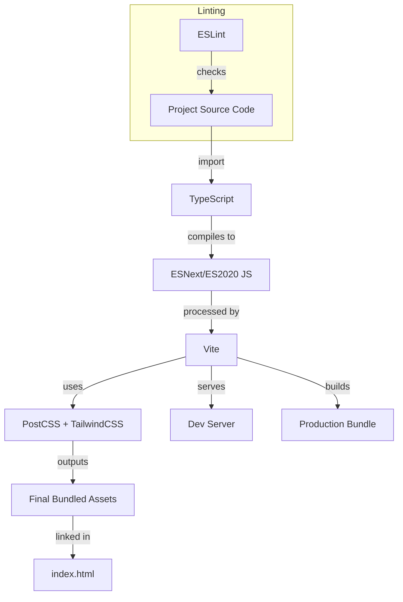

# 📚 Project Configuration & Build Documentation

This documentation explains the configuration and build files of your Vite + React + TypeScript project. Each file plays a specific role, from tooling and linting to build output and dependency management. This guide will help you understand, maintain, and extend your development environment with confidence.

---

## .gitignore

The **`.gitignore`** file tells Git which files and directories to ignore in version control. This helps avoid committing unnecessary or sensitive files.

### Ignored Items

- **Logs**: Files ending with `.log`, `npm-debug.log*`, `yarn-debug.log*`, etc.
- **Build Artifacts**: `node_modules`, `dist`, `dist-ssr`
- **Local Configs**: Files ending with `.local`, `.env`
- **Editor Files**: `.vscode/`, `.idea/`, `.DS_Store`, etc.

```plaintext
# Logs
logs
*.log
npm-debug.log*
yarn-debug.log*
yarn-error.log*
pnpm-debug.log*
lerna-debug.log*

# Dependency directories
node_modules

# Build output
dist
dist-ssr

# Local environment
*.local

# Editor directories and files
.vscode/*
!.vscode/extensions.json
.idea
.DS_Store
*.suo
*.ntvs*
*.njsproj
*.sln
*.sw?
.env
```
**Key Points:**  
- Keeps your repo clean and secure.
- Prevents accidental commits of large or sensitive files.

---

## postcss.config.js

The **`postcss.config.js`** file configures [PostCSS](https://postcss.org), a tool for transforming CSS with JavaScript. It's often used for autoprefixing and integrating Tailwind CSS.

```js
export default {
  plugins: {
    tailwindcss: {},
    autoprefixer: {},
  },
};
```
- **tailwindcss**: Enables Tailwind CSS utility classes.
- **autoprefixer**: Adds vendor prefixes for broader browser compatibility.

---

## tailwind.config.js

This file customizes [Tailwind CSS](https://tailwindcss.com/) for your project.

```js
const { default: flattenColorPalette } = require("tailwindcss/lib/util/flattenColorPalette");

/** @type {import('tailwindcss').Config} */
module.exports = {
  content: ['./index.html', './src/**/*.{js,ts,jsx,tsx}'],
  darkMode: "class",
  theme: {
    extend: {
      animation: {
        sparkle: 'sparkle 2s ease-in-out infinite',
        aurora: "aurora 60s linear infinite",
        pulse: 'pulse 4s cubic-bezier(0.4, 0, 0.6, 1) infinite',
      },
      keyframes: {
        sparkle: {
          '0%, 100%': { opacity: '0', transform: 'scale(0)' },
          '50%': { opacity: '1', transform: 'scale(1)' },
        },
        aurora: {
          from: { backgroundPosition: "50% 50%, 50% 50%" },
          to: { backgroundPosition: "350% 50%, 350% 50%" },
        },
        pulse: {
          '0%, 100%': { opacity: '0.4', transform: 'scale(1)' },
          '50%': { opacity: '0.8', transform: 'scale(1.05)' },
        },
      },
    },
  },
  plugins: [addVariablesForColors],
};

// Adds Tailwind colors as CSS variables
function addVariablesForColors({ addBase, theme }) {
  let allColors = flattenColorPalette(theme("colors"));
  let newVars = Object.fromEntries(
    Object.entries(allColors).map(([key, val]) => [`--${key}`, val])
  );
  addBase({ ":root": newVars });
}
```

**Highlights:**
- **Content**: Specifies files to scan for Tailwind classes.
- **Dark Mode**: Uses class-based toggling (`class`).
- **Theme Extensions**: Adds custom animations and keyframes.
- **Plugin**: Exposes all Tailwind colors as CSS custom properties (`var(--color-name)`).

---

## eslint.config.js

The **`eslint.config.js`** file configures [ESLint](https://eslint.org/) for code quality and style.

```js
import js from '@eslint/js';
import globals from 'globals';
import reactHooks from 'eslint-plugin-react-hooks';
import reactRefresh from 'eslint-plugin-react-refresh';
import tseslint from 'typescript-eslint';

export default tseslint.config(
  { ignores: ['dist'] },
  {
    extends: [js.configs.recommended, ...tseslint.configs.recommended],
    files: ['**/*.{ts,tsx}'],
    languageOptions: {
      ecmaVersion: 2020,
      globals: globals.browser,
    },
    plugins: {
      'react-hooks': reactHooks,
      'react-refresh': reactRefresh,
    },
    rules: {
      ...reactHooks.configs.recommended.rules,
      'react-refresh/only-export-components': [
        'warn',
        { allowConstantExport: true },
      ],
    },
  }
);
```
**Key Points:**
- **TypeScript Integration**: Uses `typescript-eslint` for linting TypeScript code.
- **React Hooks**: Enforces best practices for React hooks.
- **React Refresh**: Ensures components are exported correctly for hot reloading.
- **Ignores `dist/`**: Skips the build output in linting.

---

## index.html

This is the main HTML entry point for your web application.

```html
<!doctype html>
<html lang="en">
  <head>
    <meta charset="UTF-8" />
    <link rel="icon" type="image/svg+xml" href="/vite.svg" />
    <meta name="viewport" content="width=device-width, initial-scale=1.0" />
    <title>SocialFlow - Schedule & Auto-Post to Social Media</title>
  </head>
  <body>
    <div id="root"></div>
    <script type="module" src="/src/main.tsx"></script>
  </body>
</html>
```

**Features:**
- Loads the React app into `<div id="root"></div>`.
- Includes favicon and mobile responsiveness.
- Loads the main JS module (`main.tsx`).

---

## tsconfig.json

This is the root [TypeScript](https://www.typescriptlang.org/) configuration file.

```json
{
  "files": [],
  "references": [
    { "path": "./tsconfig.app.json" },
    { "path": "./tsconfig.node.json" }
  ]
}
```

**Purpose:**
- **Project References**: Enables [project references](https://www.typescriptlang.org/docs/handbook/project-references.html) for faster builds and better organization.
- **Delegation**: Delegates TypeScript configuration to `tsconfig.app.json` (app code) and `tsconfig.node.json` (Node/Vite config).

---

## tsconfig.node.json

TypeScript configuration for Node.js/Vite-related files (like Vite config).

```json
{
  "compilerOptions": {
    "target": "ES2022",
    "lib": ["ES2023"],
    "module": "ESNext",
    "skipLibCheck": true,
    "moduleResolution": "bundler",
    "allowImportingTsExtensions": true,
    "isolatedModules": true,
    "moduleDetection": "force",
    "noEmit": true,
    "strict": true,
    "noUnusedLocals": true,
    "noUnusedParameters": true,
    "noFallthroughCasesInSwitch": true
  },
  "include": ["vite.config.ts"]
}
```

**Key Settings:**
- **Modern JS/TS**: Targets latest ECMAScript for Node.
- **Strict Linting**: Ensures clean, error-free configs.
- **No Output**: Does not emit compiled JS.

---

## tsconfig.app.json

TypeScript configuration for the main app source code.

```json
{
  "compilerOptions": {
    "target": "ES2020",
    "useDefineForClassFields": true,
    "lib": ["ES2020", "DOM", "DOM.Iterable"],
    "module": "ESNext",
    "skipLibCheck": true,
    "moduleResolution": "bundler",
    "allowImportingTsExtensions": true,
    "isolatedModules": true,
    "moduleDetection": "force",
    "noEmit": true,
    "jsx": "react-jsx",
    "baseUrl": ".",
    "paths": {
      "@/*": ["./src/*"]
    },
    "strict": true,
    "noUnusedLocals": true,
    "noUnusedParameters": true,
    "noFallthroughCasesInSwitch": true
  },
  "include": ["src"]
}
```

| Option                     | Purpose                                                     |
|----------------------------|-------------------------------------------------------------|
| `target`, `lib`            | ECMAScript and browser feature compatibility                |
| `module`, `moduleResolution`| Modern module bundling                                     |
| `jsx`                      | Enables JSX syntax for React                                |
| `baseUrl`, `paths`         | Allows `@/` alias for easy imports                          |
| `strict`, `noUnused*`      | Enforces strict type-checking and clean code                |
| `noEmit`                   | Only type-check, don't output JS files                      |

---

## package.json

Defines your project’s dependencies, scripts, and metadata.

```json
{
  "name": "vite-react-typescript-starter",
  "private": true,
  "version": "0.0.0",
  "type": "module",
  "scripts": {
    "dev": "vite",
    "build": "vite build",
    "lint": "eslint .",
    "preview": "vite preview"
  },
  "dependencies": {
    "@radix-ui/react-slot": "^1.2.3",
    "@tsparticles/engine": "^3.8.1",
    "@tsparticles/react": "^3.0.0",
    "class-variance-authority": "^0.7.1",
    "clsx": "^2.1.1",
    "framer-motion": "^12.23.2",
    "lucide-react": "^0.344.0",
    "react": "^18.3.1",
    "react-dom": "^18.3.1",
    "react-icons": "^5.5.0",
    "tailwind-merge": "^3.3.1",
    "tsparticles": "^3.8.1"
  },
  "devDependencies": {
    "@eslint/js": "^9.9.1",
    "@types/react": "^18.3.5",
    "@types/react-dom": "^18.3.0",
    "@vitejs/plugin-react": "^4.3.1",
    "autoprefixer": "^10.4.18",
    "eslint": "^9.9.1",
    "eslint-plugin-react-hooks": "^5.1.0-rc.0",
    "eslint-plugin-react-refresh": "^0.4.11",
    "globals": "^15.9.0",
    "postcss": "^8.4.35",
    "tailwindcss": "^3.4.1",
    "typescript": "^5.5.3",
    "typescript-eslint": "^8.3.0",
    "vite": "^7.0.3"
  }
}
```

**Scripts**:
| Script   | Description             |
|----------|------------------------|
| `dev`    | Start dev server       |
| `build`  | Build for production   |
| `lint`   | Run ESLint             |
| `preview`| Preview production build|

**Dependency Highlights**:
- **React & TypeScript**: Modern React development with strong typing.
- **Vite**: Fast build tool and dev server.
- **Tailwind CSS**: Utility-first CSS framework.
- **Particles, Icons, Animation**: Rich UI/UX features.

### 📦 Install All Dependencies

```packagemanagers
{
  "commands": {
    "npm": "npm install",
    "yarn": "yarn install",
    "pnpm": "pnpm install",
    "bun": "bun install"
  }
}
```

---

## package-lock.json

This file **locks the exact versions** of all installed dependencies.  
It ensures reproducible builds and consistent installs across different environments.

- Managed automatically by npm.
- Should be committed to your repository.

---

## vite.config.ts

The Vite configuration file customizes your project's build and development server with plugins and path aliases.

```ts
import { defineConfig } from 'vite';
import react from '@vitejs/plugin-react';
import path from 'path';

// https://vitejs.dev/config/
export default defineConfig({
  plugins: [react()],
  resolve: {
    alias: {
      '@': path.resolve(__dirname, './src'),
    },
  },
  optimizeDeps: {
    exclude: ['lucide-react'],
  },
});
```

### Key Sections

- **plugins**: Adds React fast-refresh and JSX support.
- **resolve.alias**: Allows `@/` imports to reference `src/` directory.
- **optimizeDeps.exclude**: Excludes `lucide-react` from dependency pre-bundling for compatibility reasons.

---

### ⚙️ Build & Tooling Flow



---

## 📝 Summary Table

| File                  | Purpose                                                                                      |
|-----------------------|----------------------------------------------------------------------------------------------|
| .gitignore            | Ignore files/folders for Git                                                                 |
| postcss.config.js     | CSS transforms – Tailwind, autoprefixer                                                      |
| tailwind.config.js    | Tailwind CSS customization – content, theme, plugins                                         |
| eslint.config.js      | ESLint rules for TS/React, hooks, and more                                                   |
| index.html            | Main HTML entry point, loads React app                                                       |
| tsconfig.json         | TypeScript project referencing                                                               |
| tsconfig.node.json    | TS settings for Vite/Node config files                                                       |
| tsconfig.app.json     | TS settings for app code, strictness, JSX, alias                                             |
| package.json          | Project meta, dependencies, scripts                                                          |
| package-lock.json     | Locked dependency versions for reproducible installs                                         |
| vite.config.ts        | Vite build/dev settings, React plugin, path alias, dependencies optimization                  |

---

### 🚀 Getting Started

1. **Install dependencies** (see above).
2. **Start development**:
   ```bash
   npm run dev
   ```
3. **Lint your code**:
   ```bash
   npm run lint
   ```
4. **Build for production**:
   ```bash
   npm run build
   ```
5. **Preview your build**:
   ```bash
   npm run preview
   ```

---

## 🎯 Best Practices & Extending

- **Use the `@/` alias** for cleaner imports.
- **Add more ESLint rules** as your codebase grows.
- **Customize Tailwind** via `tailwind.config.js` for branding and advanced theming.
- **Leverage Vite plugins** for additional tooling (e.g., PWA, testing, etc.).

---

**Happy coding!** 🚀
